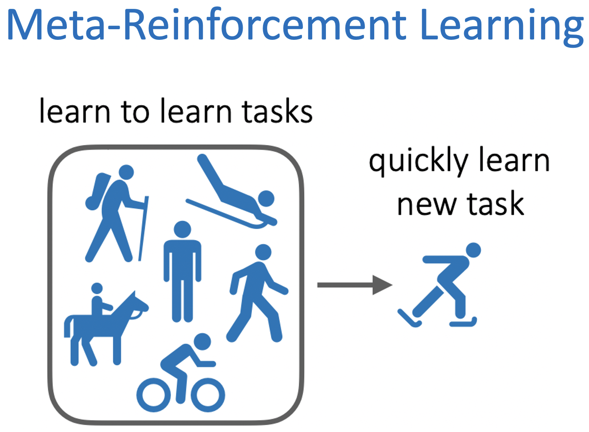

<div align="center">
  <br>
  
</div>

[Image source](https://cs330.stanford.edu/slides/cs330_lifelonglearning_karol.pdf)

<br>

[](https://opensource.org/licenses/MIT)
[](https://www.python.org/downloads/release/python-388/)
[](https://pytorch.org/blog/pytorch-1.8-released/)
[](https://github.com/psf/black)
[](https://pycqa.github.io/isort/)
[](https://pypi.org/project/pytest-pylint/)
<!-- ALL-CONTRIBUTORS-BADGE:START - Do not remove or modify this section -->
[](#contributors-)
<!-- ALL-CONTRIBUTORS-BADGE:END -->

# Meta-Reinforcement Learning Algorithms with PyTorch

This repository contains PyTorch implementations of meta-reinforcement learning algorithms.

## Prerequisites

This repository is implemented and verified on **python 3.8.8**

## Installation

To run on **pytorch 1.8.0**, enter the [pytorch version link](https://pytorch.org/get-started/previous-versions/#wheel) and run the installation command to desired specifications.

Next, clone this repository and run the following command.

```shell
$ make setup
```

## Python Path

To set python path, move to `meta-rl/`.

```shell
$ cd meta-rl
```

If setting python path on `bashrc`:

```shell
$ echo "export META_HOME=$(pwd)" >> ~/.bashrc
$ echo 'export PYTHONPATH=$META_HOME:$PYTHONPATH' >> ~/.bashrc
```

If setting python path on `zshrc`:

```shell
$ echo "export META_HOME=$(pwd)" >> ~/.zshrc
$ echo 'export PYTHONPATH=$META_HOME:$PYTHONPATH' >> ~/.zshrc
```

## Usages

The repository's high-level structure is:

    └── meta-rl
        └── src
            ├── envs
            ├── rl2
                ├── algorithm
                ├── configs
                └── results
            ├── maml
                ├── algorithm
                ├── configs
                └── results
            └── pearl
                ├── algorithm
                ├── configs
                └── results

### RL^2

TBU

### MAML

TBU

### PEARL

TBU

### Development

We have setup automatic formatters and linters for this repository.

To run the formatters:

```shell
$ make format
```

To run the linters:

```shell
$ make lint
```

New code should pass the formatters and the linters before being submitted as a PR.

## Contributors ✨

Thanks goes to these wonderful people ([emoji key](https://allcontributors.org/docs/en/emoji-key)):

<!-- ALL-CONTRIBUTORS-LIST:START - Do not remove or modify this section -->
<!-- prettier-ignore-start -->
<!-- markdownlint-disable -->
<table>
  <tr>
    <td align="center"><a href="https://github.com/dongminlee94"><br /><sub><b>Dongmin Lee</b></sub></a><br /><a href="https://github.com/dongminlee94/meta-rl/commits?author=dongminlee94" title="Code">💻</a></td>
    <td align="center"><a href="https://seunghyun-lee.tistory.com/"><br /><sub><b>Seunghyun Lee</b></sub></a><br /><a href="https://github.com/dongminlee94/meta-rl/commits?author=Clyde21c" title="Code">💻</a></td>
  </tr>
</table>

<!-- markdownlint-restore -->
<!-- prettier-ignore-end -->

<!-- ALL-CONTRIBUTORS-LIST:END -->

This project follows the [all-contributors](https://github.com/all-contributors/all-contributors) specification. Contributions of any kind welcome!